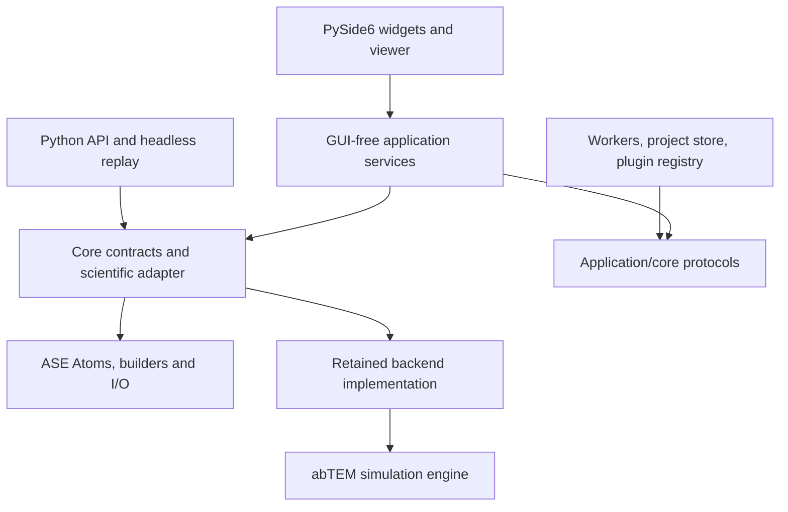

# Electron Microscopy Workbench: standalone application architecture

Status: proposed architecture; no application rewrite or scientific change in this document.
Repository reviewed at `0c2d2cf46699073848c829e42f2e001ffb69df31` (v1.5.0).
The permanent rules in [AGENTS.md](../AGENTS.md) govern implementation.

## 1. Product and scientific contract

The primary user is an experimental electron microscopist who should be able to
**open or build a specimen → orient it visually → select a microscope/preset →
Simulate** without writing Python. Build a standalone PySide6 / Qt 6 desktop
application with an independently scriptable backend. ASE remains the canonical
atomic structure engine; abTEM remains the microscopy simulation engine.

The architecture must preserve these invariants:

- One canonical, proper 3×3 orientation matrix drives the viewer and simulation.
  Its full precision survives snapshots, process transport, persistence and replay.
  Displayed Euler angles are never used to reconstruct an existing orientation.
- A simulation operates on a copy, never the document's original ASE `Atoms`.
- Finite particles, two-dimensional periodic materials and three-dimensional
  periodic crystals have explicit boundary policies. Viewing cannot change PBC.
- Atom/cell transforms and image presentation transforms remain separate.
- Every result identifies its specimen revision, orientation, effective settings,
  engine versions and any preparation/fallback that actually occurred.
- Scientific behavior, including current defaults, noise, normalization, cropping,
  CTF filtering and cell preparation, remains unchanged during migration. Any
  subsequent scientific correction requires a separate reviewed change and tests.

The core is a Python library, not an internal implementation detail of Qt.
Windows distribution is a bundled application and installer; Python, pip,
PowerShell and batch files are developer tools, never required user steps.

## 2. Repository findings and retained capabilities

The reviewed repository contains one modular package, compatibility shims,
launch/install/build scripts, documentation, two sample structures/databases and
68 collected tests. There is no Qt implementation or persistent project/job model.

| Current area | Observed behavior | Architectural treatment |
| --- | --- | --- |
| `abtem_ase_workbench/backend.py` | GUI-free TEM/diffraction pipeline; lazy abTEM import; copy-on-rotation; exact `view_axes`; cell policy; PNG/JSON output | Retain as the scientific regression baseline; wrap before considering extraction |
| `orientation.py` | Pure zone-axis, reciprocal plane-normal and view-matrix helpers | Reuse conventions and helpers; no new crystallographic mathematics |
| `gui.py` | 2,061-line Tk/ASE tool; widgets also hold state; simulations run synchronously; sweep pumps Tk events | Move orchestration into GUI-free application services, then replace frontend incrementally |
| `validators.py`, `presets.py` | GUI-free validation and instrument values; presets use kV while backend takes eV | Retain values; introduce typed units and structured diagnostics at the boundary |
| `database_2d.py` | Local ASE formats, 2DMatPedia JSON/JSONL, C2DB folder; optional pymatgen fallback | Retain offline import/provenance; imported database structures can initially have all PBC true, so require deliberate specimen preparation |
| `export.py` | Script contains exact matrix but leaves structure loading to the user; not a complete replay bundle | Preserve legacy export; add snapshot-backed project/replay export |
| `widgets.py` and GUI layout helpers | Tk/ASE widgets; duplicated panel/scroll helpers | Frontend-only legacy code; do not import into the new core |
| `__init__.py`, `abtem_tem_backend.py`, `abtem_tem.py`, `abtem_2d_database.py` | Small public API and same-module aliases, including monkey-patch compatibility | Keep existing import paths and alias identity until an explicit deprecation release |
| `launcher.py`, `run_gui.py`, `windows_app.py` | Start ASE Tk GUI; runtime menu registration | Keep legacy entrypoint alongside a new standalone Qt entrypoint during migration |
| `install.py`, `gui.py.patch`, `restore_missing_gui.py` | ASE installation patching and a compressed GUI recovery script | Legacy maintenance artifacts; never part of the new application's startup/update path |
| `pyproject.toml`, `requirements.txt` | Flat setuptools package, Python ≥3.8, broad dependency ranges | Preserve now; establish a tested desktop Python/dependency matrix before changing packaging |
| `ElectronMicroscopyWorkbench.spec`, `build_windows_exe.bat` | PyInstaller windowed portable folder, Tk imports, broad scientific collection | Starting point for packaging research, not yet an installer or validated Qt release |
| `tests/`, `TESTING.md`, `SIMPLE_TEST_CHECKLIST.md`, `ORIENTATION_FIX_1_4.md`, `examples/` | Physics, orientation, PBC, metadata, import, package and Tk gates; Pt4 visual calibration sample | Preserve assertions and manual acceptance cases; add Qt and job boundaries alongside them |

Current simulation behavior matters to the design: Auto rotates the cell when
`any(atoms.pbc)` is true, so slabs and bulk share the legacy `periodic_crystal`
metadata label. `apply_view_rotation` transforms row-vector positions by `P @ A`,
rotates periodic cell rows by `C @ A`, and recenters. Both pipelines broadly catch
propagation errors and retry using `abtem.orthogonalize_cell`; TEM can fall back
to noiseless intensity if noise application fails. Unsupported CTF keys are
recorded as ignored. These are existing behaviors, not recommendations for new
physics. Do not silently narrow exceptions, change retry/noise policy, or claim
that an orthogonalization is always an exact rigid rotation.

## 3. Dependency architecture and proposed folders

Keep the package name `abtem_ase_workbench` to avoid an unnecessary public API
rename. The tree below is a future target, not files to create in this PR. Adopt
`src/` only as a separately verified packaging change after compatibility gates.

```text
src/abtem_ase_workbench/
  __init__.py                 # existing API; must not eagerly import Qt/Tk
  backend.py                 # retained scientific implementation/compatibility
  orientation.py             # existing pure geometry helpers
  validators.py, presets.py, database_2d.py, export.py  # retained public modules
  core/
    api.py                   # documented typed backend facade
    models.py                # specimen snapshots, orientation, requests/results
    specimen.py              # ASE builders, edit commands, copy semantics
    validation.py            # structured diagnostics and capability checks
    errors.py                # frontend-neutral exceptions
    simulation.py            # adapter invoking retained backend functions
    metadata.py              # schema, checksums, replay manifest
  application/
    documents.py             # revisions, undo/redo, session operations
    requests.py              # atomic capture and unit conversion
    jobs.py                  # queue/state machine, preview/sweep policy
    ports.py                 # worker, persistence, event sink protocols
  infrastructure/
    workers.py               # spawned processes, IPC, resource ownership
    project_store.py         # versioned project and artifact persistence
    structure_io.py          # ASE I/O adapter
    plugin_registry.py       # discovery, version/capability validation
    logging.py               # rotating diagnostic logs
  gui_qt/
    main.py                  # QApplication and composition root
    main_window.py           # workspace and progressive disclosure
    controllers.py           # Qt event bindings to application services
    models.py                # Qt item models; mirrors of application state
    viewer/
      protocol.py            # frontend renderer interface
      vispy_adapter.py       # preferred renderer, convention translation only
    panels/                  # specimen, microscope, results, jobs, advanced
    help/                    # shared contextual control descriptions
    resources/               # icons, translation files, sample projects
  legacy_tk/                 # eventual home of frontend internals
  gui.py, launcher.py        # keep legacy public paths/registration compatible
  cli.py                     # headless replay, developer/script use
abtem_tem_backend.py, abtem_tem.py, abtem_2d_database.py, run_gui.py
packaging/windows/           # future Qt spec, installer recipe, build locks
schemas/                     # project/request/result versions and examples
resources/                   # versioned presets/help, packaged offline
tests/                      # see testing boundaries; existing tests retained
docs/ARCHITECTURE.md
```

Dependency direction:



Only the composition root wires concrete infrastructure to ports. Core and
application modules must not import PySide6, VisPy, Tk, `ase.gui`, GUI Matplotlib
backends or desktop dialogs. Infrastructure workers must not import the GUI.
Qt models may expose state but do not own scientific data. Importing the public
core remains lightweight; importing abTEM is deferred until simulation.

## 4. Specimen, view and document state

Use separate state objects instead of using widget values as the data model.
ASE `Atoms` is mutable, so a frozen dataclass alone is insufficient isolation.
A document service owns live atoms privately; accessors return copies. Each edit
produces a new revision. Job snapshots contain independently owned arrays and
ASE data, with read-only arrays where practical; workers reconstruct private
`Atoms` and the retained backend still copies before preparation.

| Model | Required contents and ownership |
| --- | --- |
| `SpecimenDocument` | Stable document ID, revision, private canonical `Atoms`, source/provenance, boundary kind, edit history, dirty flag |
| `SpecimenSnapshot` | Snapshot ID/revision, numbers, float64 positions/cell, exact three PBC flags, relevant ASE arrays/constraints/info, checksum, provenance; detached from document |
| `OrientationState` | Float64 3×3 `view_axes`, revision, convention ID, origin of last edit (mouse/angles/zone/plane), requested indices where applicable |
| `ViewerState` | Pan, zoom, camera distance, render style, selection/visibility, periodic-image visualization; none changes specimen or simulation |
| `PresentationState` | Result-specific contrast/colormap, image pan/zoom, presentation transform ID; no effect on geometry |
| `SimulationSettings` | Mode, explicit numeric values/units, preset ID/version plus resolved overrides, seed, grid, boundary preparation policy |
| `SimulationRequest` | Frozen specimen and orientation snapshots, resolved settings, request schema/hash, document/settings revisions, preview/full/sweep identity |
| `SimulationResult` | Request/job IDs, returned array/artifact descriptors, legacy metadata, structured manifest, warnings, status; tied to captured revisions |
| `Project` | Versioned documents/view/settings/results/history references; stores data required to reopen without original source files |

Boundary kind is derived from the three lattice-vector PBC flags, not a formula,
filename or screen direction: zero true flags = finite, two = 2D periodic, three
= 3D periodic. Record which lattice vectors are periodic and which is nonperiodic;
`[True, True, False]` is common, not the only possible slab convention. One true
flag is retained as an explicit 1D/advanced case, not coerced to a slab or bulk.
Reject contradictory kind/PBC state. Classification alone does not validate the
geometry or engine support.

Selection uses persistent atom IDs stored as an ASE array, not only row indices,
so undo/delete/repeat can remap selection. Editing operations are backend
commands with parameters and before/after revisions: add/delete/move/change
species, cell edit with explicit scaling choice, set PBC, repeat, wrap, center,
add vacuum and builders. Implement operations with ASE and preserve arrays,
constraints and provenance. Builders include common crystals, surfaces/slabs,
clusters/nanoparticles and nanotubes where ASE supports them. Allow common ASE
file loading/saving and multi-frame selection; warn if a chosen export format
cannot preserve PBC/cell/auxiliary information.

Undo/redo covers structure edits and orientation changes; high-frequency drags
coalesce into one command. Rendering-only pan/zoom need not pollute scientific
history. Switching specimens selects that document's view/settings, clears stale
selection and revalidates requests. Physical editing of atoms is distinct from
changing view orientation. No simulation, preview or export writes back into the
document. Results remain labeled with their captured revision if the user keeps
editing during a run.

## 5. Exact orientation flow

Use the existing ASE row-vector convention as the canonical convention:

```text
A = OrientationState.view_axes                  # float64, shape (3, 3)
viewer projected geometry = P @ A               # P contains Cartesian rows
specimen-frame beam direction = A[:, 2]         # third column, +z in beam frame
worker request.view_axes = exact captured A
backend.simulate_*(atoms_copy, view_axes=A, ...)
  apply_view_rotation:
    P_work = P @ A                              # then existing recentering
    C_work = C @ A for periodic structures
    C_work = original C for finite particles
  abTEM Potential receives prepared private atoms; beam remains +z
```

1. Mouse gestures, angle edits, zone axis and plane-normal actions update
   `OrientationState`. A renderer is a consumer of that state. It must not keep
   an independent authoritative camera rotation.
2. Zone/plane controls reuse `orientation.py`: `[uvw] @ cell` and
   `[hkl] @ cell.reciprocal().array`, respectively. Screen-up is part of the full
   matrix, not recoverable from beam direction alone. Nearest-zone labels are
   approximations and never silently snap the specimen.
3. Explicit angle edits construct a new matrix using the existing ASE convention
   once, then become matrix state. Readouts can round angles without feeding
   those rounded values back into orientation. Clear stale Miller provenance
   on subsequent arbitrary rotation or cell edits.
4. On Simulate/Preview/Export, commit pending edits and atomically capture atoms,
   full matrix, settings and provenance from the same document revision. Submit
   that snapshot; never reread a changing viewer during execution or a sweep.
5. Validate with the retained matrix rules: finite 3×3, orthonormal and determinant
   +1 (current tolerance `1e-6`, zero relative tolerance). Reject invalid matrices;
   no silent orthogonalization, reflection fix, transpose or Euler round trip.
6. A VisPy/Qt adapter translates canonical row-vector state into the renderer's
   homogeneous/column-vector convention where necessary. That translation is
   confined to rendering; transport and scientific APIs always receive `A`.
   Use orthographic projection as the default simulation view; pan/zoom/centering
   are visual translations/scales, not new rotations or simulation sampling.
7. IPC uses full float64 arrays with shape/dtype specified. JSON matrix values
   use round-trip precision; never use the GUI's formatted three-decimal matrix.
   Persist and replay the matrix itself and test exact equality across transport.
8. Every path (TEM, diffraction, preview, sweep, oriented structure, project/replay
   export) uses the same snapshot builder and `view_axes` pathway. Do not rotate
   the snapshot first and also pass `view_axes` into simulation: that would apply
   orientation twice. Oriented structure export is explicitly labeled as already
   oriented; its replay uses identity rather than the original matrix again.

The backend currently returns exact-view images using
`abtem_array_to_ase_screen(raw) = flipud(raw.T)`. Qt initially displays that
already converted array with a top-left origin and applies no second conversion.
Keep legacy `image_presentation=ase_gui_screen` and
`orientation_transform=ase_view_matrix` values for compatibility; the new manifest
can describe the GUI-neutral convention. A future raw-array API is additive and
requires calibration tests. Never alter atoms to correct a mirror or image axis.

Cell orthogonalization is a separate preparation step after the exact rigid
transform. The existing fallback can repeat/cut and potentially alter the cell;
record it and distinguish its effects from orientation. Exact matrix transport
must be proven at the rigid adapter and at the abTEM boundary. If a preparation
cannot preserve the intended beam/projected geometry, it must not be marketed as
an exact-view supported case. Do not change the fallback as part of GUI migration.

## 6. Deliberate specimen preparation

| Specimen | Policy retained by scientific adapter | New application contract and validation |
| --- | --- | --- |
| Finite particle/flake, all PBC false | Rotate positions on a copy, leave original box fixed, preserve PBC, recenter | Require usable vacuum box; detect insufficient clearance after orientation; offer explicit ASE centering/vacuum edit, never enable periodicity automatically |
| 2D periodic material, exactly two PBC true | Rotate atoms and cell by the same matrix; preserve PBC flags tied to lattice rows | Keep nonperiodic axis and vacuum explicit; validate tilt/preparation capability; finite flake is a deliberate PBC edit, not a view option |
| 3D periodic crystal, all PBC true | Rotate atoms and cell together; retain existing orthogonalization fallback | Keep cell/repeat/thickness preparation reproducible; validate skew-cell handling against direct ASE/abTEM and report fallback |
| 1D periodic or unusual cell | Legacy Auto is still `any(pbc)` | Advanced workflow with explicit support status and tests; no relabeling as a 3D crystal |

Normal Qt workflows derive the rotation policy from validated PBC; users choose
boundary conditions as a specimen operation, not an independent contradictory
rotation toggle. Legacy scripts retain explicit `rotate_cell` overrides and their
current results. Add a separate manifest `boundary_kind` so slabs remain distinct
without changing legacy `rotation_mode` fields.

Out-of-plane slab tilt and large skew-cell rotations are scientific capability
gates. `TESTING.md` already records tilted-slab and orthogonalization limitations;
current slab tests cover identity orientation, not arbitrary tilt. Document the
supported range empirically rather than inventing a universal angle limit. For
cases not yet validated, show an explicit unsupported/advanced status before
submission. Do not auto-add z periodicity, change vacuum, approximate orientation
or silently choose a different supercell to make the image look right. Wider
support requires a separate scientific specification and regression comparisons.

## 7. Public backend APIs and GUI boundary

Retain existing public functions and return values throughout migration:
`simulate_tem_from_atoms`, `simulate_diffraction_from_atoms`,
`simulate_tem_from_file`, `apply_view_rotation`, `apply_xyz_rotation`,
`abtem_array_to_ase_screen`, `resolve_rotate_cell`, orientation helpers,
`database_2d` loaders and `build_repro_script`. Legacy angle-only callers retain
their current behavior. Keep existing same-module shims and tested globals.

Add a documented typed facade at `abtem_ase_workbench.core.api`; the following
signatures are proposed contracts, not implemented APIs:

```python
capture_specimen(atoms: ase.Atoms, *, provenance: Provenance) -> SpecimenSnapshot
load_specimen(path: Path, *, format: str | None, frame: int) -> SpecimenSnapshot
save_specimen(snapshot: SpecimenSnapshot, path: Path, *, format: str | None) -> ExportReport
build_specimen(spec: BuilderSpec) -> SpecimenSnapshot
edit_specimen(snapshot: SpecimenSnapshot, command: SpecimenCommand) -> EditResult
validate_request(request: SimulationRequest, capabilities: EngineCapabilities) -> ValidationReport
orient_specimen(snapshot: SpecimenSnapshot, orientation: OrientationState) -> OrientedSpecimen
run_simulation(request: SimulationRequest, *, context: ExecutionContext | None = None) -> SimulationResult
export_result(result: SimulationResult, destination: Path, *, formats: tuple[str, ...]) -> ExportReport
save_project(project: ProjectSnapshot, path: Path) -> ExportReport
load_project(path: Path) -> ProjectSnapshot
export_replay(request: SimulationRequest, destination: Path) -> ExportReport
```

`run_simulation` is synchronous for scripts and worker execution. It dispatches to
the retained TEM/diffraction functions with unmodified settings and the captured
matrix; it does not import Qt, show dialogs, start an event loop or mutate its
request. `ExecutionContext` has plain Python event-sink/cancellation protocols;
the initial adapter can report only before/after a monolithic backend call.
`orient_specimen` returns a new object for export/inspection and is not used to
pre-rotate a simulation request. Persistence APIs delegate to injected I/O ports;
scientific algorithms do not know archive formats or GUI paths.

Document defaults, units, copying, exceptions, supported modes, result array
conventions and compatibility versions for every public API. Use a discriminated
TEM/diffraction settings model so unrelated fields cannot leak between modes.
Sweep plans expand deterministic requests over the current defocus/focal/angular
variables; preview overrides only its declared grid settings. Unsupported future
modes (for example STEM) are capabilities, not placeholder implementations.

Boundary rules:

- Qt widgets collect human-readable inputs; the GUI-free request builder validates
  and converts them once. The current UI uses kV while `voltage` is electron
  energy in eV (80 kV → 80000 eV). Lengths are Å, sampling Å/pixel, dose
  electrons/Ų, aberration/source angles radians, diffraction `max_angle` mrad,
  and grids integer pixels/points. Keep existing defocus/sign conventions.
- The GUI calls application services and core APIs. It must not create an abTEM
  `Potential`, run multislice, manipulate private backend helpers or inspect a
  lazy Dask graph. No unit conversion is duplicated inside worker transport.
- Services return typed data/errors/events. The GUI alone decides dialog text,
  focus, labels and display. Threads/processes never touch widgets or OpenGL.
- `EngineCapabilities` reports actual import health/version and supported CTF
  keys. Requested, applied and ignored settings remain distinguishable; unsupported
  fields are disabled or explained rather than presented as physically applied.

## 8. Simulation job system

Use a GUI-free queue with spawned worker processes, initially one active
simulation worker to avoid CPU/memory oversubscription. A process boundary avoids
blocking Qt and supports containment of native-library failures. Use Windows
`spawn` semantics on every platform during tests; entrypoint guards and
`multiprocessing.freeze_support()` are required in frozen builds. Keep a warm
worker for abTEM import/Numba startup only after memory/resource tests; correctness
must not depend on warm state. CPU is the initial supported target; GPU/Dask
execution is an explicit later capability with per-device limits.

Proposed application API:

```python
JobService.submit(request: SimulationRequest) -> JobId
JobService.submit_sweep(plan: SweepPlan) -> JobId
JobService.cancel(job_id: JobId) -> CancelReceipt
JobService.status(job_id: JobId) -> JobStatus
JobService.events(after_sequence: int) -> list[JobEvent]
```

Events carry sequence, job/request IDs, captured revision, timestamp, stage,
optional completed/total work, warning/error and artifact references. Qt's adapter
bridges them through queued signals on the main thread. Qt timers can poll IPC;
there is no blocking `join()` or manual event pumping in a widget callback.

State machine:

```text
queued → validating → running → saving → succeeded
   └───────────── failed (diagnostic attached) ─────────────┘
queued → cancelled
running/saving → cancel_requested → cancelled
worker crash/app shutdown → interrupted
```

Validation failure is terminal `failed` with no scientific execution. A worker
crash is `interrupted`, distinct from a scientific validation error. Cancel and
completion races resolve in the service under one state transition rule: once a
completed artifact transaction commits, completion wins; otherwise cancel prevents
publication. Terminal events are emitted once. Retry creates a new job ID linked
to the prior request; never silently retries with altered physics/settings.

Transport a versioned envelope and numeric arrays/ASE snapshot data, not Qt
objects, open files or arbitrary plugin objects. Validate shape, dtype, checksums
and schema on receipt. Store large arrays in per-job files or controlled shared
memory rather than repeatedly copying images through signals. Ownership and
cleanup belong to the job service; close/remove resources on success, cancellation,
crash and shutdown. Results point to artifacts whose validity is checked before
Qt loads them. Avoid pickle as an on-disk project format.

Cancellation is honest: remove queued work immediately; check between sweep
items and exposed stages. The current backend call is monolithic, so cooperative
cancellation cannot interrupt an abTEM/Numba computation mid-call. Show “Cancel
requested; finishing current calculation” when appropriate. If needed, terminate
only the isolated owned worker, discard its staging outputs and start a fresh
worker. Never force-kill a GUI thread or publish a half-written result. Application
close offers waiting or cancelling active jobs and saves document state separately.

Progress initially reports meaningful stages (starting engine, computing, saving)
and item counts for sweeps. Use indeterminate progress during opaque calculations,
not fabricated percentages. Finer progress hooks may later be added without
changing numerical order or abTEM calculations, and require parity tests.

Preview uses the same pipeline and captured matrix with explicit smaller grid
settings, labeled as a preview. Debounce changes, keep at most one pending latest
preview per document, and discard stale preview events by revision/generation.
A completed full result remains accessible even when its document has changed.
Full runs take priority over previews. Sweeps capture one base specimen/orientation,
assign stable item IDs/parameters/seeds, and save independent outcomes plus a
manifest/index. Support cancellation between items and explicit partial completion;
resume only missing items with matching request/engine identity. Do not reuse exit
waves or change seed policy as a migration optimization.

## 9. Errors, diagnostics and experimentalist UX

Expose frontend-neutral `WorkbenchError` with stable code, stage, safe summary,
field references, suggested action, job ID and a diagnostic log reference. Types
include invalid structure/orientation/settings, unsupported boundary/capability,
engine unavailable, computation failure, out-of-memory, I/O failure, plugin
failure, cancellation and worker interruption. Preserve original exception chains
in diagnostic logs, not ordinary dialogs. Unexpected failures cross IPC as bounded
structured diagnostics, never exception objects or traceback text in the main UI.

Validation returns errors and warnings separately. Errors prevent submission;
warnings explain an experimentally relevant tradeoff. Acknowledgments are tied
to the exact request, not remembered across changed scientific inputs. Engine
availability failure in an installed product offers repair/update/support, not a
`pip install` instruction. A saving failure retains a valid computed artifact so
export can be retried without rerunning physics. Never label that export successful.
Legacy fallback/noise/ignored-parameter metadata is translated into visible
warnings; broad legacy catch behavior stays intact pending separate scientific
review. Additive diagnostics must not replace engine-authored facts.

Use one Qt workspace with specimen viewer, a compact microscope panel, results
and a persistent Simulate/progress/cancel area. Put cell/PBC/sample preparation,
atom editing, crystallographic controls, aberrations, grids, database import and
sweeps in discoverable panels/Advanced disclosure. Retain useful ASE functionality,
not ASE's old appearance. Show boundary badges (“Finite particle”, “2D periodic
material”, “3D periodic crystal”) and units next to values. Presets fill editable
fields and are starting points, not claims about a user's calibrated microscope.

Every non-obvious control uses one help definition shared by tooltip on hover,
keyboard-focus help and clickable help. Include plain meaning, units, useful
ranges where defensible, physical effect and warnings. Support keyboard navigation,
accessible labels, high-DPI scaling and layouts that fit laptops. The matrix is
available in advanced diagnostics/export; the normal workflow does not require
users to understand matrices. Periodic display copies/hidden atoms are clearly
visual aids and do not alter what is simulated.

VisPy is the preferred high-performance viewer candidate, behind a renderer
interface supporting scene updates, picking, selection, cell/PBC visualization
and applying canonical orientation. Validate PySide6 integration, Windows driver
coverage, large-structure performance and projection/handedness before adoption.
Any alternative must pass the same tests. Renderer fallback must retain the same
matrix or disable simulation with a clear reason; never silently change orientation.

## 10. Metadata, persistence and reproducibility

Keep existing PNG/JSON exports and their field names. Add a versioned manifest
with namespaces so caller provenance/plugins cannot overwrite engine facts as
legacy `extra_metadata.update(...)` currently permits. Preserve the legacy dict
for compatibility; the new authoritative manifest is built from captured request
and engine result, not current widgets. Record:

| Namespace | Required evidence |
| --- | --- |
| Identity | Schema/application version, build/commit, project/document/revision, snapshot/request/job IDs, UTC creation/start/end timestamps |
| Specimen | Exact numbers, positions, cell, PBC, simulation-relevant arrays, constraints/info where supported, source bytes/hash, database/source ID, preparation/edit provenance |
| Orientation | Full float64 matrix, convention/version, source of edit, requested zone/plane, optional derived display angles/nearest-zone error; no rounded replay values |
| Request | Mode, full resolved parameters with units/defaults, preset ID/version and overrides, seed and RNG policy, preview/sweep overrides, resource/backend selection |
| Effective execution | Engine/library/Python/OS/CPU or GPU versions, applied/ignored CTF values, noise actually applied, orthogonalization/fallback flags, timings and diagnostics |
| Output | Array dtype/shape/axis order, returned versus raw/normalized status, image presentation transform, crop/log/normalization settings, paths and checksums |
| Extensions | Plugin IDs/versions/configuration, namespaced metadata and capability decisions |

Store a project as a versioned `.emw` archive: JSON manifest and float64 numeric
payloads (for example NPZ with object loading disabled), ASE-compatible structure
exports for interchange, and optional result artifacts. An embedded lossless
snapshot is authoritative; original filenames and extxyz alone are insufficient
for every ASE array/constraint. Define supported ASE serialization and reject or
report unsupported objects explicitly, not silently discard them. No arbitrary
Python execution when opening projects. Validate versions, archive paths and
payload limits before extraction. Write through staging and an atomic commit;
keep a recovery copy for interrupted saves. Put result/cache/log data in writable
user directories, never the installation directory.

Separate project schema from request/result/IPC schemas. Migrations operate on
copies, preserve original payloads and report unknown/newer versions; do not guess
missing matrix values from a screenshot or rounded angle fields. Legacy sidecars
can be imported as incomplete records when source data is unavailable, with clear
replay limitations. Cache identity hashes canonical typed specimen data, full
matrix, settings/seed, preparation policy and engine/adapter versions; exclude
presentation contrast and timestamps. Do not reuse cache across changed physics.

Export replay includes the embedded input specimen, exact request, environment
versions/lock information and an optional headless Python script using public
APIs. Normal users can rerun through “Open project → Run again”. Preserve current
legacy image arrays, which are normalized and may be noisy/log-scaled/cropped;
do not call them raw quantitative measurements. A later raw/calibrated-result API
must be designed and scientifically tested separately. Full metadata enables
reproduction but does not promise bit-identical results across engines, hardware
or numerical libraries; compare with documented tolerances. Unsupported effective
preparation details currently absent from legacy metadata are explicit gaps to
close with additive instrumentation and parity tests, not invented facts.

## 11. Extensibility

Start with explicit built-in registrations and protocols; no plugin framework is
needed to port the GUI. Define small extension points for ASE-backed builders,
structure/database importers, instrument presets/help, result exporters and viewer
adapters. Scientific modes may be added later only through a versioned simulation
adapter contract and ASE/abTEM comparison gates. Plugins cannot override canonical
orientation, silently change boundary conditions, or claim unsupported physics.

A descriptor contains stable ID, plugin/API version range, capabilities, parameter
schema with units/help and metadata namespace. Discover developer-installed
extensions via Python entry points; instantiate lazily, validate compatibility,
and isolate optional import failures from startup. Separate GUI extension hooks
from core hooks so headless clients never require Qt. Persist plugin identity and
resolved configuration, and report missing plugins when reopening projects.

The first Windows release bundles a tested allowlist; normal users do not install
Python packages. Third-party executable plugins require an explicit future
installation/trust/update policy. A worker process helps contain failures but is
not a security sandbox. Prefer data-only presets/import descriptors where possible;
never load executable code from a specimen/project archive.

## 12. Testing boundaries and acceptance gates

Existing passing tests remain the baseline; none is removed or weakened. Keep
legacy tests in place while adding dedicated layers:

| Layer | Tests and allowed dependencies |
| --- | --- |
| Core unit | Matrix validation/serialization, ASE edit copying, units, boundary classification, request/metadata schemas; no Qt/Tk or display |
| Scientific integration | Retained physics gates and direct ASE/abTEM comparisons; finite Pt13 anti-tiling, Si diffraction, shot noise, graphene/MoS2, non-mutation |
| Orientation contract | Asymmetric Pt4/non-symmetric geometry, compound rotations and full roll; exact transport equality, relative `P @ A` projection and periodic `C @ A`; reject reflections; recenter translation handled separately |
| Application/jobs | Fake worker/events for revisions, cancellation races, stale previews, sweep/resume, resource limits, failure/export separation; real spawned-process transport and crash cleanup tests |
| Persistence | Lossless specimen/matrix round-trip, hashes, old/new versions, interrupted save recovery, replay without source path, missing plugin and unsupported ASE state |
| Qt frontend | `pytest-qt`/Qt event-loop tests with fake backend; editing/selection, undo, presets, accessible help, progress/cancel, GUI responsiveness; no real physics required |
| Viewer integration | Actual renderer tests for picking, row/column conversion, handedness and result presentation; Pt4 visual calibration, fixed transpose/flip applied exactly once |
| Distribution | Clean Windows install/launch/uninstall, frozen spawned worker, Unicode/space paths, standard user permissions, missing/old graphics driver, bundled import and full specimen workflows |

Extend import tests to prohibit PySide6/VisPy/Tk/`ase.gui` in new core/application
imports and prohibit GUI imports inside workers. Existing `conftest.py` registers
the Tk tool for legacy tests; new core test execution needs a separate harness
without that registration. Extend direct comparisons to adapter and actual engine
input, not just mocks. Out-of-plane slabs, non-xy PBC axes, skew/non-cubic cells,
finite box clearance and orthogonalization orientation need new scientific gates
before claiming general support. Symmetric cubic images alone cannot expose
orientation mistakes. Every future orientation fix requires an asymmetric test;
every physics fix requires an independent regression assertion.

Use quick pure tests per change, scientific tests for adapter work, Qt tests for
frontend work, and the complete legacy suite at migration milestones. Release
requires the manual cases in `SIMPLE_TEST_CHECKLIST.md` plus Windows installer
acceptance. Treat skipped scientific/GUI tests as incomplete evidence, never a
successful substitute for running those layers.

### Documentation-task baseline

Executed before writing this document on Python 3.12.14, ASE 3.29.0, abTEM 1.0.10,
NumPy 2.5.3 and pytest 9.1.1:

| Command | Before | After |
| --- | --- | --- |
| `pytest` | 44 passed, 24 skipped | 44 passed, 24 skipped |
| `pytest --run-slow` | 53 passed, 15 skipped | 53 passed, 15 skipped |
| `xvfb-run -a pytest --run-slow --run-gui` | 67 passed, 1 skipped | 67 passed, 1 skipped |

All six backend physics tests and all fourteen GUI tests passed in the full run.
The remaining skip is the existing CIF writer gate (`test_local_import_cif`);
it is not evidence that CIF export works in this environment. Dependency
warnings include ASE/NumPy shape deprecations. The configured virtualenv and Xvfb
were used; Xvfb needed execution outside sandbox socket restrictions. Tests and
scientific source remain unchanged by this documentation task.

## 13. Migration and Windows delivery plan

Implement each stage as a focused task branch/PR with runnable old workflows and
an explicit acceptance gate. No stage below is implemented by this document.

| Stage | Deliverable | Exit gate |
| --- | --- | --- |
| 0. Lock baseline | Capture current API/physics/defaults/metadata and reference environment; catalog useful ASE actions and known scientific limitations | Existing fast/slow/full suites; Pt4, Pt13, Si, graphene/MoS2 manual baseline |
| 1. Contracts and facade | Immutable snapshots, typed request/result, unit conversion, errors/manifest; facade delegates unchanged to current backend | Direct old/new parity for arrays and effective metadata with fixed seeds; no GUI imports; compatibility aliases unchanged |
| 2. Job service | Headless spawned worker/IPC, queue, progress, cancellation, preview and sweep orchestration | Race/stale-result/crash/save tests, identical numerical calls and input ownership |
| 3. Qt shell and renderer spike | Independent PySide6 entrypoint, basic open/orient/preset/simulate/result flow, VisPy evaluation | Asymmetric exact matrix/handedness/picking tests on Windows; responsive real simulation; no Tk dependency in new entrypoint |
| 4. Feature parity | ASE-backed editing/builders/cell/PBC/wrap/repeat/vacuum, undo/redo, zones/planes, database import, export/replay, advanced settings/sweeps | Retained ASE feature checklist plus automated Qt tests and full scientific/legacy gates |
| 5. Project/recovery system | Versioned archives, replay bundles, session recovery and effective-preparation instrumentation | Lossless round-trip/replay, source-independent runs, save/crash recovery; instrumentation changes pass parity |
| 6. Windows release pilot | Pinned build environment, bundled Qt/scientific runtime, signed installer and packaged worker | Clean standard-user Windows install and full workflows; no developer tools or terminal needed |
| 7. Default switch | Promote Qt application after microscopist usability pilot; publish legacy transition/deprecation policy | No missing practical ASE capability; accepted scientific limitations visible; rollback package and old project data retained |

The Tk frontend can adopt new request/job services in a separate migration PR,
but it stays supported until Qt parity. Preserve `gui.py`, `launcher.py`,
`abtem-ase-gui` and module aliases; do not embed Tk inside Qt or run competing GUI
event loops. Keep a separate new entrypoint (for example `emw`) during the pilot.
Move private Tk code only after proving public imports/monkey-patching still work.
Retire install patching/recovery scripts from normal distribution, without
rewriting historical scientific behavior to simplify the new frontend.

Windows packaging should start with a tested PyInstaller one-folder Qt build
rather than assuming the current Tk spec can be reused unchanged. Pin a supported
Python/ASE/abTEM/PySide6/NumPy stack in release build locks, include Qt platform and
renderer assets plus abTEM/ASE data and dynamic imports, and verify lazy engine
imports in the frozen worker. Record licenses/notices and the build manifest.
Replace silent missing-hook assumptions with packaged smoke tests. Numba/cache
paths must be writable per-user; validate first-run compilation/startup and
worker spawn before choosing performance optimizations.

Wrap the bundle with an installer such as Inno Setup producing
`ElectronMicroscopyWorkbench-Setup.exe`, optional Desktop and Start Menu shortcuts,
a normal uninstall entry and file-open integration. Support per-user installation
without administrator rights where feasible. Sign executable/installer releases;
updates replace binaries while preserving user projects, logs and settings.
Validate on clean supported Windows machines without Python, including high DPI,
non-ASCII usernames/paths, offline launch, CPU-only systems and graphics failures.
Offer readable repair/support diagnostics. The existing `.bat` remains a developer
build convenience, never the end-user installation procedure.

## 14. Decisions requiring evidence before implementation expands scope

- VisPy versus another supported Qt renderer: decide by matrix/picking/Windows
  driver/performance evidence; the viewer protocol prevents scientific coupling.
- Slab tilt/skew-cell support: direct engine preparation comparisons must establish
  the supported cases; architecture cannot assert a universal safe tilt.
- Raw measurements/calibration and detailed cell-preparation records: additive
  API/instrumentation work needs scientific review; normalized legacy PNGs do not
  become quantitative data by changing labels.
- Desktop dependency pins and installer support matrix: current broad ≥3.8
  package metadata is not a promise of a usable Qt bundle on every Python/OS.
- Worker memory/concurrency/GPU tuning: measure representative experimental
  workloads before raising concurrency or adding numerical reuse.

These decisions do not delay the documentation or authorize physics changes.
The first implementation goal is a tested facade and a responsive Qt workflow
that preserve the exact specimen orientation and the existing scientific results.
